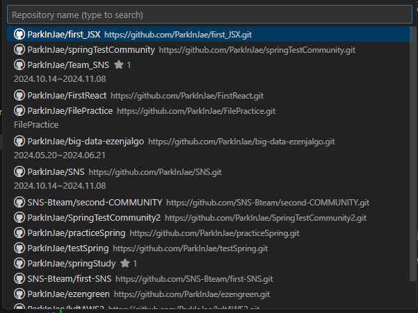
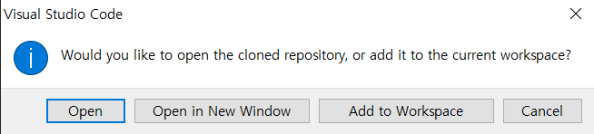
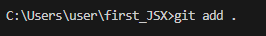
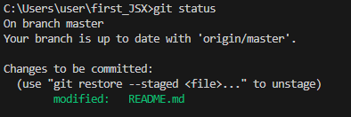
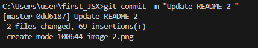
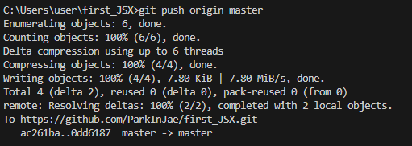
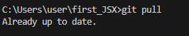

// git과 관련된 주요 내용 

-- 기존 존재하는 프로젝트를 다운 받는게 아닌 새로운 프로젝트를 생성 후 git의 새로운 repository와 연동시키기 위해서는 먼저 git init을 사용해야한다. 
# git init 
.git 하위 디렉토리 생성함 

# git add . 
커밋에 모든 파일 변경 사항을 포함 

# git pull 
pull 을 통해서 내용을 받을 수 있음 

-- 미리 만들어진 git을 다른 컴퓨터에서 받아올 때  

* VSCode 기준 
1. F1 누른 후 git clone 검색 
https://code.visualstudio.com/download
2. 깃허브 계정과 연동 

3. 깃허브 연동시 git repository URL 입력 및 git repository를 선택할 수 있음 

 3-1  URL 입력 >> repository 들어간 후 code 화면에서 HTTPS의 링크 복사 후 VSCode에서 입력 

 3-2 git repository 선택 >> 해당 화면처럼 본인이 repository를 선택할 수 있음 

4. 저장할 local 위치 선택 
-- 본인의 경우에는 c\users\user에 저장해놓음 (조만간 따로 개별 폴더 생성 후 내부에 보관할 예정 )

5. Open 클릭 
-- Open : 현재 열려있는 VSCode에서 Open 

-- Open in New Window : 새로운 창으로 VSCode Opeen

-- Add to Workspace : 현재 열려있는 VSCode에 Workspace를 추가함 

6. 위의 내용을 통해서 git의 내용을 가져온 걸 확인할 수 있다. 

* 깃 허브 push 및 pull로 받는 순서 

1. git add .
-- 커밋에 파일 변경 사항을 한번에 모두 포함 해서 add로 추가함 
ex :: git add . 

(생략 가능)
git status 
--  파일의 상태를 확인할 수 있음 
ex :: git add . 후 git status를 사용한다면 아래의 이미지를 확인할 수 있음 

2. git commit -m "커밋 메시지" 
--  커밋 생성 (기존 파일의 변경사항을 확정)
ex :: git commit -m "Update README" 

3. git push origin "브랜치이름" 
--  commit을 통해 변경한 사항을 원격 서버에 업로드함 
ex :: git push origin -m master 

4.  git pull 
-- 원격 저장소의 변경 내용이 현재 디렉토리에 가져와지고(fetch) 병합됨 (merge)
ex :: git pull

* 리엑트 관련된 내용 

# Getting Started with Create React App

This project was bootstrapped with [Create React App](https://github.com/facebook/create-react-app).

## Available Scripts

In the project directory, you can run:

### `npm start`

Runs the app in the development mode.\
Open [http://localhost:3000](http://localhost:3000) to view it in your browser.

The page will reload when you make changes.\
You may also see any lint errors in the console.

### `npm test`

Launches the test runner in the interactive watch mode.\
See the section about [running tests](https://facebook.github.io/create-react-app/docs/running-tests) for more information.

### `npm run build`

Builds the app for production to the `build` folder.\
It correctly bundles React in production mode and optimizes the build for the best performance.

The build is minified and the filenames include the hashes.\
Your app is ready to be deployed!

See the section about [deployment](https://facebook.github.io/create-react-app/docs/deployment) for more information.

### `npm run eject`

**Note: this is a one-way operation. Once you `eject`, you can't go back!**

If you aren't satisfied with the build tool and configuration choices, you can `eject` at any time. This command will remove the single build dependency from your project.

Instead, it will copy all the configuration files and the transitive dependencies (webpack, Babel, ESLint, etc) right into your project so you have full control over them. All of the commands except `eject` will still work, but they will point to the copied scripts so you can tweak them. At this point you're on your own.

You don't have to ever use `eject`. The curated feature set is suitable for small and middle deployments, and you shouldn't feel obligated to use this feature. However we understand that this tool wouldn't be useful if you couldn't customize it when you are ready for it.

## Learn More

You can learn more in the [Create React App documentation](https://facebook.github.io/create-react-app/docs/getting-started).

To learn React, check out the [React documentation](https://reactjs.org/).

### Code Splitting

This section has moved here: [https://facebook.github.io/create-react-app/docs/code-splitting](https://facebook.github.io/create-react-app/docs/code-splitting)

### Analyzing the Bundle Size

This section has moved here: [https://facebook.github.io/create-react-app/docs/analyzing-the-bundle-size](https://facebook.github.io/create-react-app/docs/analyzing-the-bundle-size)

### Making a Progressive Web App

This section has moved here: [https://facebook.github.io/create-react-app/docs/making-a-progressive-web-app](https://facebook.github.io/create-react-app/docs/making-a-progressive-web-app)

### Advanced Configuration

This section has moved here: [https://facebook.github.io/create-react-app/docs/advanced-configuration](https://facebook.github.io/create-react-app/docs/advanced-configuration)

### Deployment

This section has moved here: [https://facebook.github.io/create-react-app/docs/deployment](https://facebook.github.io/create-react-app/docs/deployment)

### `npm run build` fails to minify

This section has moved here: [https://facebook.github.io/create-react-app/docs/troubleshooting#npm-run-build-fails-to-minify](https://facebook.github.io/create-react-app/docs/troubleshooting#npm-run-build-fails-to-minify)
